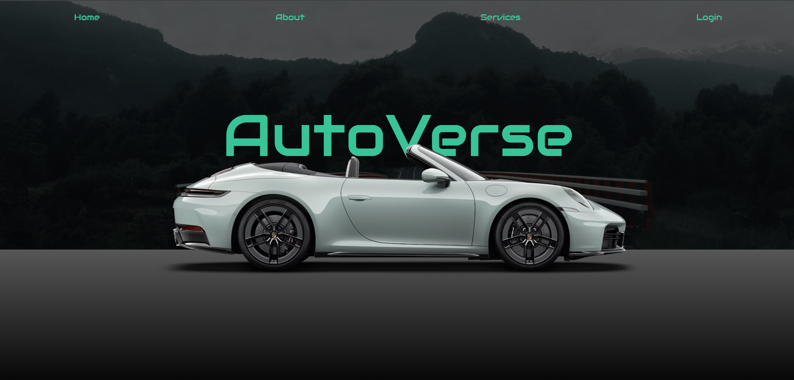
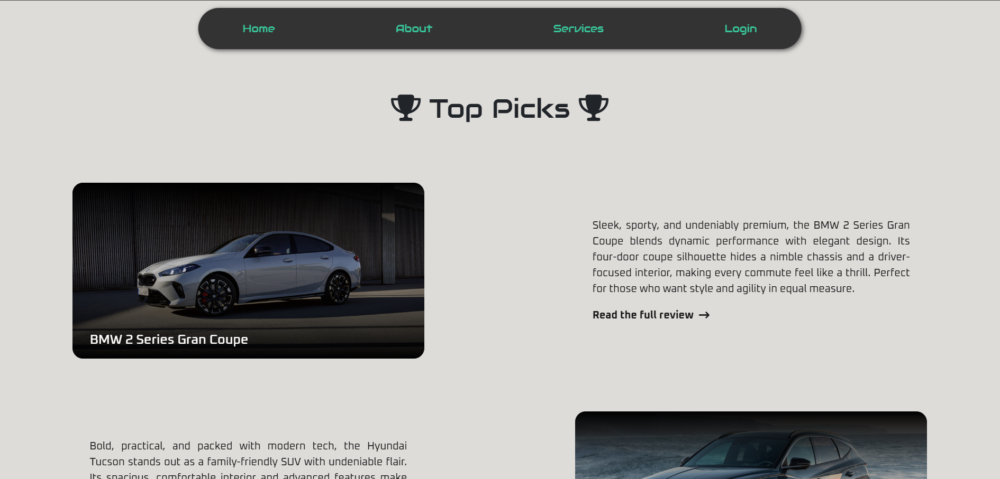

# AutoVerse

AutoVerse is a full-stack automotive platform built using Laravel, PHP, and PostgreSQL. Designed for car enthusiasts, the platform enables users to browse detailed vehicle reviews, compare cars, manage wishlists, and explore rental services through a responsive and user-friendly interface.

## Live Demo

https://autoverse-main-gzfe0w.free.laravel.cloud/

## Screenshots

| Homepage | Reviews |
|----------|---------|
|  |  |

| Comparison | Admin Dashboard |
|------------|----------------|
|  |  |
---

## Features

### User Features

* User registration and authentication
* Browse detailed vehicle reviews
* Compare multiple vehicles
* Add and manage wishlist items
* Rent vehicles through the platform
* View rental information and status
* Manage user profile information

### Admin Features

* Secure admin authentication
* Add, update, and delete vehicle information
* Manage car reviews and content
* Approve or reject rental requests
* Track rental lifecycle and status updates
* Manage platform users and data

### Rental Management

* Vehicle rental requests
* Rental approval workflow
* Rental status tracking
* Rental history management

---

## Technology Stack

### Backend

* Laravel
* PHP
* PostgreSQL

### Frontend

* HTML5
* CSS3
* JavaScript
* Bootstrap

### Tools

* Git
* Composer

---

## Project Highlights

* Full-stack web application built using the Laravel framework
* PostgreSQL-backed relational database design
* Secure authentication and authorization workflows
* Vehicle comparison functionality
* Wishlist management system
* Vehicle rental workflow implementation
* Dedicated user and admin dashboards
* Responsive user interface

---

## Installation

```bash
git clone https://github.com/yourusername/autoverse.git

cd autoverse

composer install

cp .env.example .env

php artisan key:generate

php artisan migrate

php artisan serve
```

Update the PostgreSQL database credentials in the `.env` file before running migrations.

---

## Learning Outcomes

Through AutoVerse, I gained practical experience in:

* Full-stack web development
* Laravel application architecture
* PostgreSQL database design
* Authentication and authorization
* CRUD application development
* Database relationship management
* User and admin dashboard development
* Software design and project organization

---

## License

This project was developed for educational and portfolio purposes.
